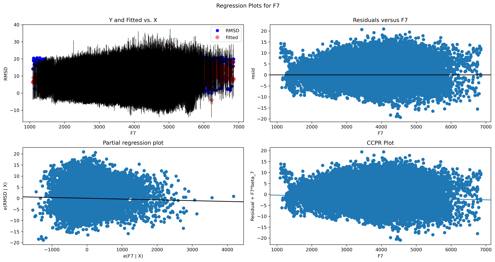
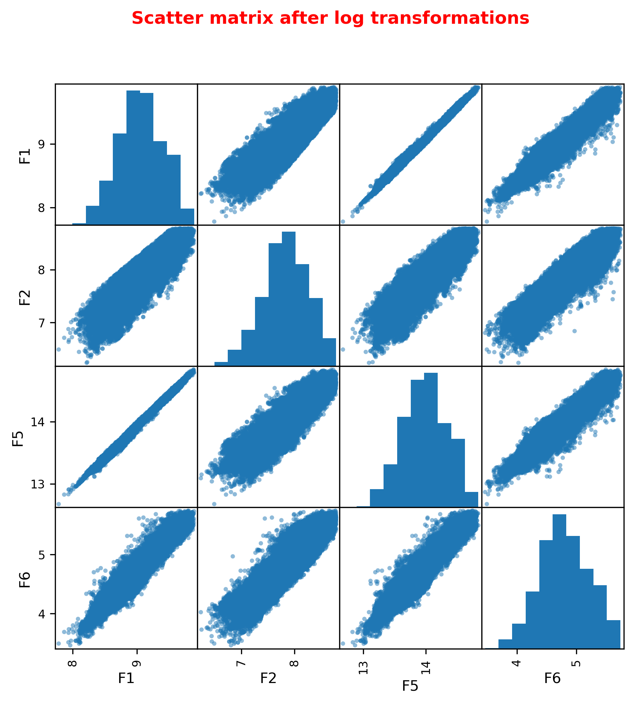
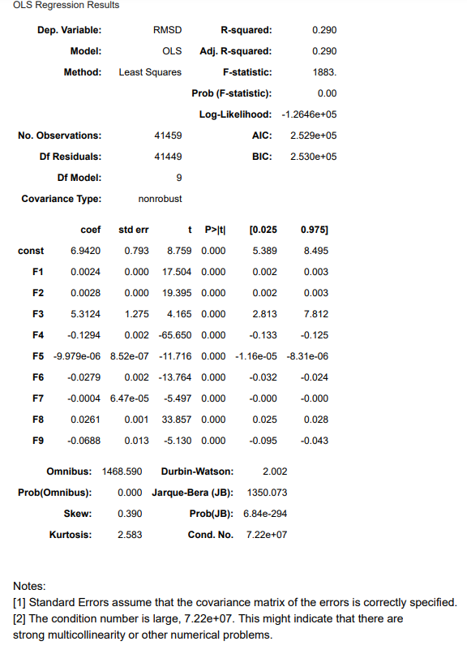
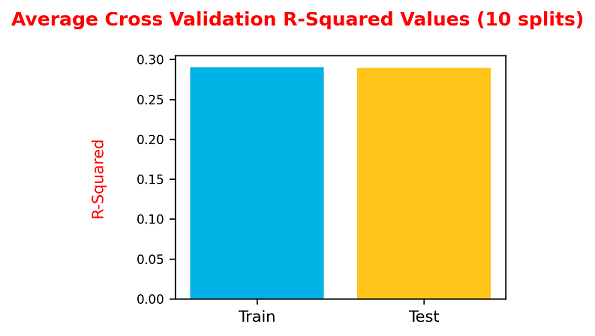

## DAT Capstone Project

**Student name: Ravinarayan Raghupathi, MSc PhD**

**Instructor name: Hardik Idnani**

### Background
   

    
Proteins are naturally occurring complex biological molecules that perform a variety of essential functions in living organisms. They are polymers of amino acids joined together by chemical bonds and the sequence of the amino acid residues determine each protein's unique structure and function.
    
The tertiary structure of a protein is its three-dimensional (3D) folded shape and is defined by its atomic co-ordinates. The amino acid residues in the folded protein can be hidden or exposed. Analysing where these residues are in the final 3D shape is of key importance in understanding protein function.
        

    
   

    
**3D STRUCTURE OF A PROTEIN**
        
   

        

        

    
*(Image source:pngwing.com)*
     
 

 

    
The prediction of a protein's tertiary structure is crucial in understanding protein-drug, protein-protein interactions, etc., and remains one of the most challenging exercises in bioinformatics, because of the number of variables involved. Over the last decade or so, machine-learning and other soft-computing techniques have become popular tools in protein structure prediction. 
    

    
### Overview

###  Scientific problem:
  

Will regression analysis be able to determine which physicochemical factors are important in predicting the tertiary structure of a protein?
    

### My strategy
  

Here I use multilinear regression analysis of a freely available dataset that includes 9 physicochemical properties (the independent variables) to assess their effect on predicting the dependent variable RMSD (Root Mean Square Deviation) of residue size (ranging from 0 to 21 Ångströms) in a decoy set. Decoys are computer-generated tertiary structures for a given amino acid sequence. All the variables are numerical and continuous and there are no categorical variables present in the dataset. The data was originally obtained from the Critical Assessment of protein Structure Prediction (CASP) 5 to 9 experiments.
    

    
### Source of data

(http://archive.ics.uci.edu/dataset/265/physicochemical+properties+of+protein+tertiary+structure)

### Brief description of variables in the dataset:

RMSD: Size of the residue.

F1: Total surface area.

F2: Non polar exposed area.

F3: Fractional area of exposed non polar residue.

F4: Fractional area of exposed non polar part of residue.

F5: Molecular mass weighted exposed area.

F6: Average deviation from standard exposed area of residue.

F7: Euclidean distance.

F8: Secondary structure penalty.

F9: Spatial Distribution constraints (N,K Value).
   

   
### Step 1: Exploratory data analysis
  

Analysed the given dataset to create a dataframe, checked for NaN and unique values, checked distribution and linearity of variables and eliminated outliers if required. 
    

#### Distribution of predictors
Checked how the predictors are distributed using combined KDE and histogram plots.

#### Distribution of dependent variable
Checked how the dependent variable is distributed using a combined KDE and histogram plot.

#### Linearity check
Used scatter plots to check the relationship between the dependent and the independent variables.

#### Removal of outliers
  

    
It appeared from the dataframe statistics and the linearity plots that there were definitely outliers in some independent variable columns that needed to be eliminated. I first visualised the outliers using boxplots and then removed them from the independent variables using the IQR method and checked the new distribution of the independent variables with histograms.
    

The independent variables appeared to be more normally distributed after the removal of outliers. 
    

### Step 2: Baseline model (Iteration 1)

    
Performed multilinear Ordinary Least Squares (OLS) regression, created a baseline model and tested assumptions of regression in that model.
    

    
#### Created the Baseline model
The summary of OLS regression statistics from Model 1 is displayed below.

#### Assumptions of regression - Model 1

    
Here I visualised whether the model satisfied the assumptions of linearity, homoskedasticity and normality. 
    

    
##### Linearity check

[Linearity1](./Images/Linearity_check_Model1.png)

##### Skedasticity check

##### Normality check
        

### Observations - Baseline model

    

        
1. The adjusted R-squared value is very low (0.29) and indicates that variance in the independent variable can only be predicted less than 30% of the time.
     
2. The assumption for linearity is difficult to visualise (given the number of data points) but appears to be satisfactory. The assumptions for homoskedasticity and normality appear to be satisfied in this model.
    
3. The values for kurtosis and skewness are within acceptable limits but the high Condition number suggests multicollinearity, which will need to be examined and dealt with.
    

    
### Step 3: Model 2 (Iteration 2)
 

    
Checked for multicollinearity, transformed variables, rendered revised model(s) and retested assumptions of regression as required in the new model(s).
    

    
#### Multicollinearity check
   

    
I checked for multicollinearity using scatter and correlation matrices and a heatmap, with corresponding subsequent analysis. 
      

      

    
I observed from my analyses that with the exception of the variables "F3' and 'F8', the remaining variables were all highly correlated with 6 other variables each. This would be expected, given that most of them represented measurements that were closely related. However, dropping any or more of these variables might not help in this particular regression analysis. It might be worth transforming some of the variables and seeing the effect on a new model.
    

#### Log transformation of independent variables
   

    
I performed log transformation of the variables 'F1', 'F2', 'F5' and 'F6', and visualised the results with a scatter matrix.
         

    
There was clearly still multicollinearity betweeen the transformed variables, as would be expected. Here I created a new model, to see if there was actually any improvement after variable transformation.
    

#### Created Model 2
The summary of OLS regression statistics from Model 2 is displayed below.

#### Assumptions of regression - Model 2
   

    
Given that there was almost no difference in the two models, there was no point in checking whether Model 2 satisfied the assumptions of linearity and homoskedasticity as they would likely be the same as before. However, checking the normality assumption would provide information about whether log transformation of some variables improved the Q-Q plot. 
        

##### Normality check

### Observations: Model 2
   

        
1. There is no major difference between Models 1 and 2, in fact the statistics seem to have worsened. 
    
2. The normality plot has also worsened, indicating that Model 1 is better for further analysis. No futher tweaking of the variables will improve the regression modelling.
            

  

    
**Note: I performed several iterations by dropping various combinations of columns both before and after log transformation (not shown here). In no case was I able to improve upon Model 1 statistics and as pointed out above, most of the models were very poor and could not be used. Therefore I have chosen to go with Model 1 for validation.**
      

### Step 4: Model validation
   

    
Here I performed both Train-Test splits and Cross-Validation on the final model. I compared the Mean Squared and R-Squared Error values across the splits, and computed the accuracy of the model.  
        

        
##### Train-test split visualisations.

##### Cross validation visualisations

**ACCURACY OF THE MODEL: 0.27546723825388264**

##### Random Forest regression analysis
   

    
Scientific literature suggests that using Random Forest Regressor (RFR) modelling can help reduce the Mean Squared Error in a model and improve its accuracy. However, this requires significant computing power. I decided to run the RFR with the default settings to see if I could improve the modelling results.
    

**RANDOM FOREST REGRESSOR MODEL ERROR RESULTS:**

**Mean Squared Error is 12.012106346138834**

    
It appeared that baseline Random Forest regression had reduced the Mean Squared Error by more than half, compared to the Test data error results from both Train-Test and K-fold (Cross) validations.
    

    
### Conclusions
   

        
1. The multilinear regression model appears to be fitted well as evidenced by the significantly low differences in R-Squared and Mean Squared Error (MSE) values between the Train and Test datasets. However, the R-Squared value is too low to be considered statistically useful and the MSE values are still very high.
    
2. The model will predict correctly around 27% of the time, which is very low for the prediction accuracy that was the goal of this regression analysis.
    
3. I was able to reduce the MSE by around 50% by using the Random Forest Regressor. This might be the best approach to modelling data of the kind studied here, however it requires much more powerful computing resources than are available to me at this point.
        

    
### Actionable insight
  

    
Multilinear regression analysis of physicochemical measurements might not be the best approach to predicting the tertiary structure of proteins, given that many of these measurements are likely to be highly correlated.
            
  